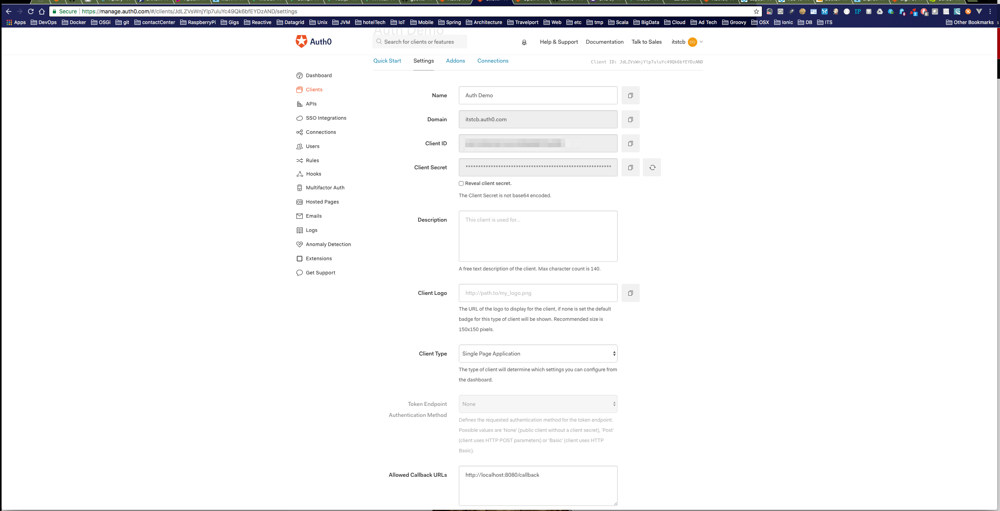

<!-- TOC depthFrom:1 depthTo:6 withLinks:1 updateOnSave:1 orderedList:0 -->

- [Overview](#overview)
	- [Motivation](#motivation)
	- [The Admin Console application](#the-admin-console-application)
- [Pre-Requests](#pre-requests)
- [Getting Started](#getting-started)
	- [Compile, Build and Run](#compile-build-and-run)
		- [Frontend](#frontend)
		- [Backend](#backend)
	- [Auth0 Setup](#auth0-setup)
	- [Logging In](#logging-in)
- [Admin Console](#admin-console)
	- [LinkedIn Profile](#linkedin-profile)
- [Auth0 integration](#auth0-integration)
- [Spring Boot integration](#spring-boot-integration)
- [References](#references)

<!-- /TOC -->
# Overview
This project demonstrates the use of following:
* Vue.js framework to build Javascript applications
* Auth0 SaaS for authentication and authorization, including LinkedIn authentication
* Spring Boot and Spring for deploying and serving the Vue.js Javascript application

## Motivation
* Research and compare modern Javascript UI application frameworks and decide on a framework to create an open source project. I have development AngularJS applications in the past, but wanted to take some time to decide on using AngularJS 2.xx or using an alternative. I research and compared pros and cons of ReactJS, AngularJS 2 and Vue.js and selected Vue.js as the framework to use. Rather than building a 'Hello World' type superfluous application, I decided to use the Vue.js + Bootstap based Admin Console template from coreui.io as it looked to me like a good starter application that demonstrates the capabilities of a Vue.js application.

* I also wanted to refresh my Javascript skills, learn ES6 additions like the module system, lear more about NodeJS (import/export, require) as well as build systems like Webpack and Browserfy. Getting low down with Bootstap 4 was another important motivation of putting this project together.

* Auth0 takes away the pain of authentication, authorization, user management (registration, password reset) and you can use their hosted services as a SaaS solution. There many other things Auth0 provides including SSO, social media integration (for OAuth authentication). I wanted to explore the use of Auth0 and specifically using it with Vue.js.

* The final piece was on the options of deploying and serving the frontend applications. Using NodeJS and Express, Heroku is one option, but being a huge fan of Springboot, I wanted to explore how a modern Javascript application can be deployed using a Spring Boot application. The idea is to be able to use all Javascript ecosystem tools during the development and for building a production artifact (minified) using Javascript tools, but be able to integrate artifact with a Spring Boot application so that it can be deployed and hosted as a JVM application.

## The Admin Console application
* frontend
  * Vue.js
  * Bootstrap 4 (Vue.js Components)
  * Auth0
  * CoreUI Vui.js Admin Console Template
  * LinkedIn authentication (via Auth0)
  * npm, Webpack
  * Javascript

* Backend
  * Spring Boot
  * Gradle
  * Scala

----


# Pre-Requests
* [NodeJS](https://nodejs.org/en/download/)
* [JDK 1.8.x.x](https://java.com/en/download/)
* [Git](https://git-scm.com/book/en/v2/Getting-Started-Installing-Git)
* [An Auth0 Account - free](https://auth0.com/signup)


----


# Getting Started

## Compile, Build and Run

1. Clone the project, below is the project structure. `vue-ui` contains the frontend code, and `springboot-server` contains the backend code.

        admin-console/
        ├── README.md
        ├── gradle
        │   └── wrapper
        ├── gradlew
        ├── gradlew.bat
        ├── npm-debug.log
        ├── settings.gradle
        ├── springboot-server
        │   ├── build
        │   ├── build.gradle
        │   ├── out
        │   └── src
        └── vue-ui
            ├── CHANGELOG.md
            ├── README.md
            ├── build
            ├── build.gradle
            ├── config
            ├── dist
            ├── index.html
            ├── node_modules
            ├── package.json
            ├── scss
            ├── src
            ├── static
            └── test

2. Install Dependencies

    ```
    cd vue-ui
    npm install
    ```

    Above installs the standard CoreUI Template and standard Vue.js application dependencies. Additionally, install the following dependencies.

    ```
    npm install sinon@2.1.0 popper.js
    npm install jquery
    npm install EventEmitter auth0-js
    npm install vue2-simplert-plugin
    ```

### Frontend
Compile and build process is handled by Webpack. The `build` and `config` directories contain the NodeJS Javascript files and Webpack configuration. During development you basically use Webpack + NodeJS to compile, build and run. Webpack enables hot-loading.

```
cd vue-ui
npm run dev
```

This should compile, build, and run the application using NodeJS + Express. On successful, the above command automatically lunches the browser/new tab and you should see the Welcome page below.


### Backend
Use the following Gradle command to compile, build and run the Spring Boot backend.

```
cd admin-console
./gradlew -Dspring.profiles.active=local clean build bootRun
```

You should see something like below:

```
  ### 09:02:04.433 main - INFO - o.s.b.a.e.jmx.EndpointMBeanExporter: Located managed bean 'healthEndpoint': registering with JMX server as MBean [org.springframework.boot:type=Endpoint,name=healthEndpoint]
  ### 09:02:04.436 main - INFO - o.s.b.a.e.jmx.EndpointMBeanExporter: Located managed bean 'beansEndpoint': registering with JMX server as MBean [org.springframework.boot:type=Endpoint,name=beansEndpoint]
  ### 09:02:04.438 main - INFO - o.s.b.a.e.jmx.EndpointMBeanExporter: Located managed bean 'infoEndpoint': registering with JMX server as MBean [org.springframework.boot:type=Endpoint,name=infoEndpoint]
  ### 09:02:04.441 main - INFO - o.s.b.a.e.jmx.EndpointMBeanExporter: Located managed bean 'loggersEndpoint': registering with JMX server as MBean [org.springframework.boot:type=Endpoint,name=loggersEndpoint]
  ### 09:02:04.446 main - INFO - o.s.b.a.e.jmx.EndpointMBeanExporter: Located managed bean 'metricsEndpoint': registering with JMX server as MBean [org.springframework.boot:type=Endpoint,name=metricsEndpoint]
  ### 09:02:04.448 main - INFO - o.s.b.a.e.jmx.EndpointMBeanExporter: Located managed bean 'traceEndpoint': registering with JMX server as MBean [org.springframework.boot:type=Endpoint,name=traceEndpoint]
  ### 09:02:04.451 main - INFO - o.s.b.a.e.jmx.EndpointMBeanExporter: Located managed bean 'dumpEndpoint': registering with JMX server as MBean [org.springframework.boot:type=Endpoint,name=dumpEndpoint]
  ### 09:02:04.453 main - INFO - o.s.b.a.e.jmx.EndpointMBeanExporter: Located managed bean 'autoConfigurationReportEndpoint': registering with JMX server as MBean [org.springframework.boot:type=Endpoint,name=autoConfigurationReportEndpoint]
  ### 09:02:04.454 main - INFO - o.s.b.a.e.jmx.EndpointMBeanExporter: Located managed bean 'configurationPropertiesReportEndpoint': registering with JMX server as MBean [org.springframework.boot:type=Endpoint,name=configurationPropertiesReportEndpoint]
  ### 09:02:04.456 main - INFO - o.s.i.endpoint.EventDrivenConsumer: Adding {logging-channel-adapter:_org.springframework.integration.errorLogger} as a subscriber to the 'errorChannel' channel
  ### 09:02:04.456 main - INFO - o.s.i.c.PublishSubscribeChannel: Channel 'application:local.errorChannel' has 1 subscriber(s).
  ### 09:02:04.456 main - INFO - o.s.i.endpoint.EventDrivenConsumer: started _org.springframework.integration.errorLogger
  ### 09:02:04.471 main - INFO - o.a.coyote.http11.Http11NioProtocol: Initializing ProtocolHandler ["http-nio-8080"]
  ### 09:02:04.478 main - INFO - o.a.coyote.http11.Http11NioProtocol: Starting ProtocolHandler ["http-nio-8080"]
  ### 09:02:04.496 main - INFO - o.a.tomcat.util.net.NioSelectorPool: Using a shared selector for servlet write/read
  ### 09:02:04.509 main - INFO - o.s.b.c.e.t.TomcatEmbeddedServletContainer: Tomcat started on port(s): 8080 (http)
  ### 09:02:04.510 main - INFO - c.i.d.a.ui.server.SpringbootApp$: *************************************************************
  ### 09:02:04.510 main - INFO - c.i.d.a.ui.server.SpringbootApp$: ******************* Successfully Started ********************
  ### 09:02:04.510 main - INFO - c.i.d.a.ui.server.SpringbootApp$: *************************************************************
  ### 09:02:04.514 main - INFO - scala.App: Started App in 2.91 seconds (JVM running for 3.381)
  ### 09:02:07.773 http-nio-8080-exec-1 - INFO - o.a.c.c.C.[Tomcat].[localhost].[/]: Initializing Spring FrameworkServlet 'dispatcherServlet'
  ### 09:02:07.773 http-nio-8080-exec-1 - INFO - o.s.web.servlet.DispatcherServlet: FrameworkServlet 'dispatcherServlet': initialization started
  ### 09:02:07.790 http-nio-8080-exec-1 - INFO - o.s.web.servlet.DispatcherServlet: FrameworkServlet 'dispatcherServlet': initialization completed in 16 ms
  <============-> 95% EXECUTING [48s]
  > :springboot-server:bootRun

```

----

## Auth0 Setup
  1. Create an Auth0 [Account](https://auth0.com/signup)
  2. Navigate to the (Dashboard)[https://manage.auth0.com/#/]
  3. Select `Create Client` to add a new client. One Auth0 account can have several types of application clients in a multi-tenant setup
  4. Note the `Client ID` and `Domain` values, these must be set as `clientId` and `domain` in the `auth0-variables.js` below
  5. Select `APIs` and not the `API Audience` value, this goes in the `apiUrl` of the `auth0-variables.js` below
  6. Set `Allowed Callback URLs` to `http://localhost:8080/callback`
  7. Select `Connections -> Social` and enable the ones like you'd like to try. E.g LinkedIn
  8. Create `vue-ui/src/auth/auth0-variables.js` file with its content as below.
      ```
      export const AUTH_CONFIG = {
      clientId: '[YOUR CLIENT ID]',
      domain: '[YOUR DOMAIN]',
      callbackUrl: 'http://localhost:8080/callback',
      apiUrl: [YOUR API URL]
      }
      ```

  Below is the client that I created for this demo app.

  

## Logging In
Once Auth0 setup is done as above, you should be able to hit `Login` from the `Welcome` page. The browser does a redirect to the [Auth0 Hosted Login Page](https://auth0.com/docs/hosted-pages/login) where you will be able to register as a new user and login, or use any of the enabled social media logins.

If you use LinkedIn, you'll see prompt below:
  

Once authorized, you should see Auth0's Hosted Login Page (AKA Lock). Use LinkedIn credentials to login.
  


----


# Admin Console
The Admin Console is pretty much the standard CoreUI template. For the this demo I [downloaded](https://github.com/mrholek/CoreUI-Vue) the free version and added Auth0 integration. I used the `Vue_Full_Project` sources and made the following changes:

* Added
  * src/auth directory for Auth0 integration
  * src/views/WelcomeView.vue

* Changed
  * src/main.js
  * src/components/Header.vue  
  * src/components/HeaderDropdown.vue
  * src/router/index.js

On login, you should see the Admin Console's Dashboard:


## LinkedIn Profile
If you authenticated via LinkedIn, your picture should display at the top right hand side. Click that, and you should see your LinkedIn Profile like below.


----


# Auth0 integration


----


# Spring Boot integration
----

# References
* [Vui.js](https://vuejs.org/v2/guide/index.html)
* [Vue.js API](https://vuejs.org/v2/api/#Global-Config)
* [Great resource for all things Web, Javascript, ES6, and more](https://developer.mozilla.org/en-US/)
* [Auth0 Open Source](https://auth0.com/opensource)
* [Auth0 Quick Start](https://auth0.com/docs/quickstarts)
* [Auth0 Libraries](https://auth0.com/docs/libraries)
* [Auth0 Javascript Library](https://auth0.com/docs/libraries/auth0js/v8)
* [Auth0 Hosted Login Page, AKA Lock](https://auth0.com/docs/hosted-pages/login)
* [Auth0 Vue.js Samples](https://github.com/auth0-samples/auth0-vue-samples)
* [Bootstap Vue.js UI Coponents](https://bootstrap-vue.js.org/)
* [Good Bootstrap 4 Reference](https://www.quackit.com/bootstrap/bootstrap_4/tutorial/)
* [Simple Alert Vue.js Component](http://www.vuescript.com/simple-alert-component-vue-js-2/)
* [CoreUI Vue.js Templates](http://coreui.io/templates/vue-templates/)
* [CoreUI docs](http://coreui.io/docs/layout/options/)
* [Good NodeJS and Express Intro](https://developer.mozilla.org/en-US/docs/Learn/Server-side/Express_Nodejs/Introduction)
* [npm](https://www.npmjs.com/)
* [Webpack](https://webpack.js.org/)
* [Spring Boot](https://projects.spring.io/spring-boot/)
* [Gradle Build Tool](https://gradle.org/)
* [Scala](https://www.scala-lang.org/)
